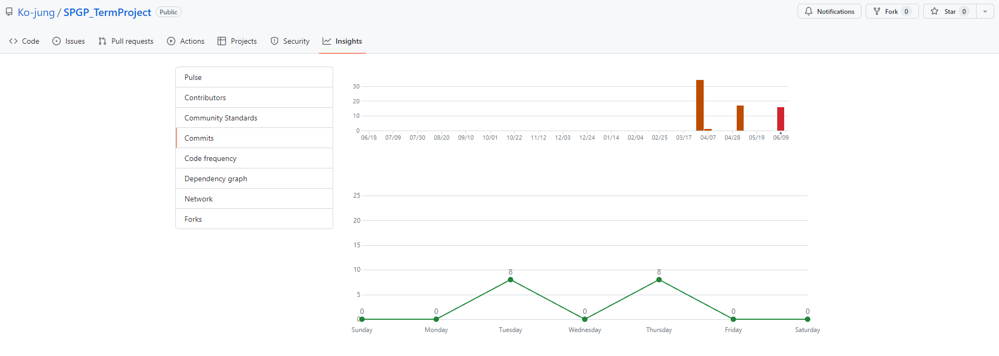

# 리듬 세상 for Android
> 스마트폰 게임 프로그래밍 텀프로젝트

>닌텐도 사의 DS게임 ['리듬 세상'](https://www.youtube.com/watch?v=FwdBLgFA7qM&ab_channel=Japancommercials4U2)의 모방 게임입니다.

## 게임 컨셉
모티브 게임: Nintendo DS 리듬세상

장르: 리듬 게임

타이밍에 맞게 Touch 및 Hold, Slide를 하여 점수를 얻고, 일정 점수 이상이 되어야 게임을 클리어 할 수 있으며, 그 게임은 여러 종류가 존재합니다.

## 개발 계획/일정/실제 진행

+ 개발 진척도

|목표|달성치|
|--|--|
|타이틀|100%|
|로비|100%|
|게임1|80%|
|게임2|0%|
|게임3|0%|
|리듬 노트|0%|
|게임 결과 메세지|0%|

+ 주차별 커밋 횟수

+ 목표가 변경된 내용

	+ 졸업 작품 준비로 시간분배에 실패했습니다.
	+ 게임 개수: 3 -> 1
	+ 리듬 노트: O -> X
	+ 게임 결과 메세지: O -> X
 
## 코드 관련
- 사용된 기술
    + X	
- 참고한 것들
   + Android Developers 문서, 교수님 코드, ChatGPT
- 수업내용에서 차용한 것
    + Framework
- 직접 개발한 것
    + CollsionChecker의 Block이 아닌 Overlapped 방식 구현

## 아쉬운 점
- 하고 싶었지만 못 한 것들
    + 완성
    + 핸드폰 흔들기
- (앱을 스토어에 판다면) 팔기 위해 보충할 것들
    + 꾸밀 수 있는 데코 아이템
    + 추가적인 스테이지
- 결국 해결하지 못한 문제/버그
    + 현재 스테이지 완료시 최대 점수가 아닌 최신 점수가 기록되는 문제

## 수업에 대한 내용
- 이번 수업에서 기대한 것
    + 모바일 환경 게임 개발 경험 습득
- 얻은 것
    + 모바일 환경 게임 개발 경험
- 얻지 못한 것
    + 좀 더 완벽한 개발 경험