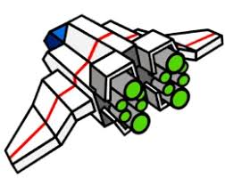

# 리듬 세상 for Android
> 스마트폰 게임 프로그래밍 텀프로젝트
닌텐도 사의 NDS게임 ['리듬 세상'](https://www.youtube.com/watch?v=FwdBLgFA7qM&ab_channel=Japancommercials4U2)의 모방 게임입니다.

## 게임 컨셉


## 개발 범위
게임 타이틀, 게임 로비, 게임 3개

게임1: [팬클럽](https://www.youtube.com/watch?v=e90ZA60n7wo&pp=ygUX66as65Os7IS47IOBIO2MrO2BtOufvSA%3D)


게임2: [로봇 공장](https://www.youtube.com/watch?v=p16F9XIyFcU&pp=ygUZ66as65Os7IS47IOBIOuhnOu0h-qzteyepQ%3D%3D)


게임3: [슈팅](https://www.youtube.com/watch?v=82T71E_IBuQ&pp=ygUT66as65Os7IS47IOBIOyKiO2MhQ%3D%3D)



사진: [나무위키](https://namu.wiki/w/%EB%A6%AC%EB%93%AC%20%EC%84%B8%EC%83%81/%EC%88%98%EB%A1%9D%20%EA%B2%8C%EC%9E%84)


OS X & 리눅스:

```sh
npm install my-crazy-module --save
```

윈도우:

```sh
edit autoexec.bat
```

## 예상 게임 실행 흐름

스크린 샷과 코드 예제를 통해 사용 방법을 자세히 설명합니다.

_더 많은 예제와 사용법은 [Wiki][wiki]를 참고하세요._

## 개발 일정

|일자|개발 내용|
|--|--|
|1주(04.04-04.10)|Resoure 수집|
|2주(04.11-04.17)|게임 타이틀, 게임 선택 화면 UI 구성|
|3주(04.18-04.24)|게임 1, 2, 3 UI 제작|
|4주(04.25-05.01)|게임 1 게임 제작(Sprite, 노트)|
|5주(05.02-05.08)|게임 1 작동 확인|
|6주(05.09-05.15)|점수 및 랭크 시스템 구현|
|7주(05.16-05.22)|게임 2 게임 제작|
|8주(05.23-05.29)|게임 31 게임 제작|
|9주(05.30-06.05)|테스트 및 버그 수정|

## 업데이트 내역

* 0.2.1
    * 수정: 문서 업데이트 (모듈 코드 동일)
* 0.2.0
    * 수정: `setDefaultXYZ()` 메서드 제거
    * 추가: `init()` 메서드 추가
* 0.1.1
    * 버그 수정: `baz()` 메서드 호출 시 부팅되지 않는 현상 (@컨트리뷰터 감사합니다!)
* 0.1.0
    * 첫 출시
    * 수정: `foo()` 메서드 네이밍을 `bar()`로 수정
* 0.0.1
    * 작업 진행 중

## 정보

이름 – [@트위터 주소](https://twitter.com/dbader_org) – 이메일주소@example.com

XYZ 라이센스를 준수하며 ``LICENSE``에서 자세한 정보를 확인할 수 있습니다.

[https://github.com/yourname/github-link](https://github.com/dbader/)

## 기여 방법

1. (<https://github.com/yourname/yourproject/fork>)을 포크합니다.
2. (`git checkout -b feature/fooBar`) 명령어로 새 브랜치를 만드세요.
3. (`git commit -am 'Add some fooBar'`) 명령어로 커밋하세요.
4. (`git push origin feature/fooBar`) 명령어로 브랜치에 푸시하세요. 
5. 풀리퀘스트를 보내주세요.

<!-- Markdown link & img dfn's -->
[npm-image]: https://img.shields.io/npm/v/datadog-metrics.svg?style=flat-square
[npm-url]: https://npmjs.org/package/datadog-metrics
[npm-downloads]: https://img.shields.io/npm/dm/datadog-metrics.svg?style=flat-square
[travis-image]: https://img.shields.io/travis/dbader/node-datadog-metrics/master.svg?style=flat-square
[travis-url]: https://travis-ci.org/dbader/node-datadog-metrics
[wiki]: https://github.com/yourname/yourproject/wiki