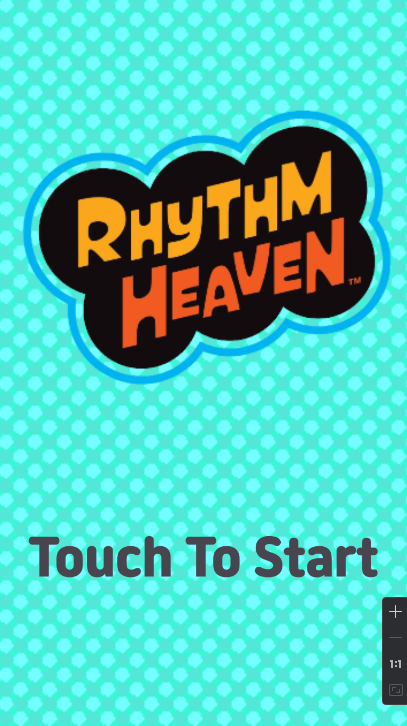
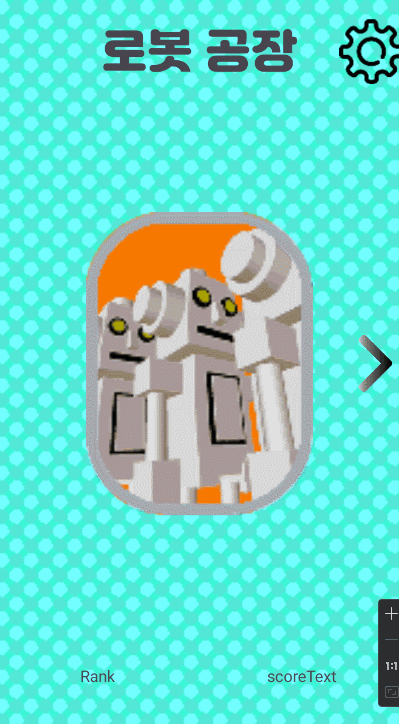

# 리듬 세상 for Android
> 스마트폰 게임 프로그래밍 텀프로젝트

>닌텐도 사의 DS게임 ['리듬 세상'](https://www.youtube.com/watch?v=FwdBLgFA7qM&ab_channel=Japancommercials4U2)의 모방 게임입니다.

## 게임 컨셉
모티브 게임: Nintendo DS 리듬세상

장르: 리듬 게임

타이밍에 맞게 Touch 및 Hold, Slide를 하여 점수를 얻고, 일정 점수 이상이 되어야 게임을 클리어 할 수 있으며, 그 게임은 여러 종류가 존재합니다.

## 진행 상황

게임 타이틀

게임 선택 화면

게임 화면

전체 약 20% 진행

## git commit
|일자|커밋 수|
|--|--|
|1주(04.04-04.10)|4|
|2주(04.11-04.17)|1|
|3주(04.18-04.24)|0|
|4주(04.25-05.01)|0|
|5주(05.02-05.08)|7|
|6주(05.09-05.15)|2|

## 목표 변경
X

## MainScene 에 등장하는 game object

+ class Convayor
	+ 로봇 공장에서 바닥에 배치될 컨베이어 벨트입니다.
	+ 횡 이동을 하며 로봇이 이동하게끔 보이게합니다.
	+ 상호작용은 없으며 계속해서 옆으로 이동합니다.

+ class Robot
	+ 리듬 타이밍을 나타낼 로봇입니다.
	+ 횡 이동을 하며 로봇 그림 뒤에 액체를 나타낼 이미지가 하나 더 그려집니다.
	+ 나중에 추가될 Pump와 상호작용을 할 예정이며 상호작용시 뒤에 그려지는 액체가 점점 차오르는 효과가 존재합니다.

## 개발 일정

|일자|개발 내용|
|--|--|
|6주(05.09-05.15)|로봇 공장 게임 제작 및 점수 구현|
|7주(05.16-05.22)|팬클럽 게임제작|
|8주(05.23-05.29)|슈팅 게임 제작|
|9주(05.30-06.05)|테스트 및 버그 수정|