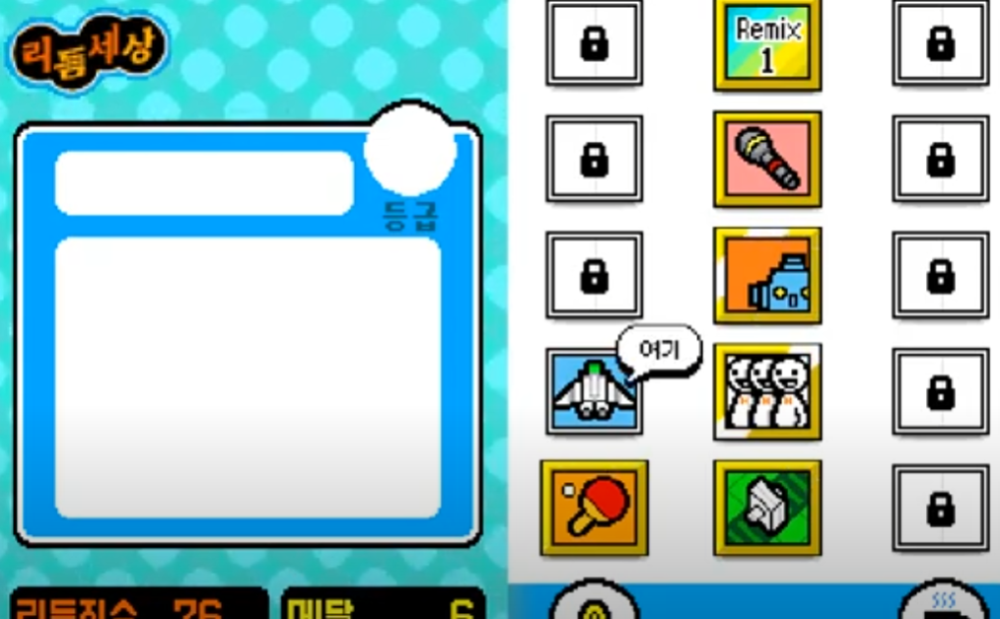
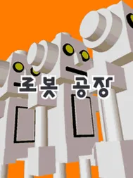

# 리듬 세상 for Android
> 스마트폰 게임 프로그래밍 텀프로젝트

>닌텐도 사의 DS게임 ['리듬 세상'](https://www.youtube.com/watch?v=FwdBLgFA7qM&ab_channel=Japancommercials4U2)의 모방 게임입니다.

## 게임 컨셉
모티브 게임: Nintendo DS 리듬세상

장르: 리듬 게임

타이밍에 맞게 Touch 및 Hold, Slide를 하여 점수를 얻고, 일정 점수 이상이 되어야 게임을 클리어 할 수 있으며, 그 게임은 여러 종류가 존재합니다.

## 개발 범위
1. 게임 타이틀

2. 게임 로비

3. 게임1: [팬클럽](https://www.youtube.com/watch?v=e90ZA60n7wo&pp=ygUX66as65Os7IS47IOBIO2MrO2BtOufvSA%3D)

4. 게임2: [로봇 공장](https://www.youtube.com/watch?v=p16F9XIyFcU&pp=ygUZ66as65Os7IS47IOBIOuhnOu0h-qzteyepQ%3D%3D)

5. 게임3: [슈팅](https://www.youtube.com/watch?v=82T71E_IBuQ&pp=ygUT66as65Os7IS47IOBIOyKiO2MhQ%3D%3D)

6. 게임 종료 및 랭크: 예시

>사진: [나무위키](https://namu.wiki/w/%EB%A6%AC%EB%93%AC%20%EC%84%B8%EC%83%81/%EC%88%98%EB%A1%9D%20%EA%B2%8C%EC%9E%84) & [타이틀](https://m.blog.naver.com/qkdrnwoddl9/222095456664) & [게임로비](https://www.youtube.com/watch?v=82T71E_IBuQ&pp=ygUT66as65Os7IS47IOBIOyKiO2MhQ%3D%3D)

## 예상 게임 실행 흐름
게임 실행

게임 타이틀 화면

게임 로비 화면

===
>아래 로비 화면을 제외한 목록은 실제 게임과 같은 방식으로 진행되며, 화면이 양 옆으로 배치가 아닌 위 아래로 배치할 예정

게임 로비 화면

 :arrow_down_small:

게임 시작

 :arrow_down_small:

Touch, Hold, Slide로 게임 진행

 :arrow_down_small:

게임 종료 및 결과 출력

 :arrow_down_small:

게임 로비 화면 (반복)

## 개발 일정

|일자|개발 내용|
|--|--|
|1주(04.04-04.10)|Resoure 수집|
|2주(04.11-04.17)|게임 타이틀, 게임 선택 화면 UI 구성|
|3주(04.18-04.24)|모든 게임 UI 제작|
|4주(04.25-05.01)|팬클럽 게임 제작(Sprite, 노트)|
|5주(05.02-05.08)|팬클럽 작동 확인|
|6주(05.09-05.15)|점수 및 랭크 시스템 구현|
|7주(05.16-05.22)|로봇 공장 게임 제작|
|8주(05.23-05.29)|슈팅 게임 제작(스크롤링 사용)|
|9주(05.30-06.05)|테스트 및 버그 수정|